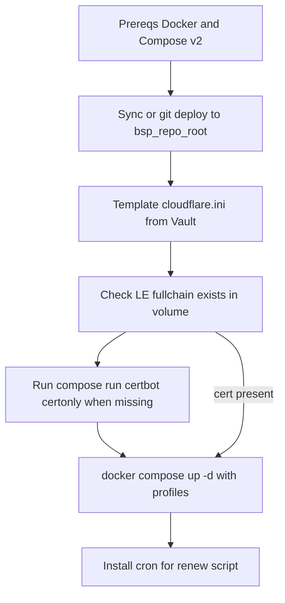

# Ansible playbook: production bootstrap (LE order)

## Relationship to the TLS plan

This playbook automates the **bootstrap order** documented in [`.cursor/plans/let's_encrypt_dns-01_58f65e37.plan.md`](.cursor/plans/let's_encrypt_dns-01_58f65e37.plan.md): stable repo path, [`infra/secrets/cloudflare.ini`](infra/secrets/cloudflare.ini), initial `certonly`, then `docker compose up`, then cron for [`infra/scripts/renew-letsencrypt.sh`](infra/scripts/renew-letsencrypt.sh).

**Prerequisite:** [compose.prod.yml](compose.prod.yml), [`infra/nginx/default.prod.conf`](infra/nginx/default.prod.conf), certbot service + `production` profile, renew script, and `.gitignore` for secrets exist as described in that plan. The Ansible work **does not replace** those files; it **drives** them on the droplet.

There is **no** existing `ansible/` tree in the repo today; this plan adds one.

## Layout (proposed)

| Path | Purpose |
|------|--------|
| [`infra/ansible/README.md`](infra/ansible/README.md) | How to run: inventory example, required vars, Vault for token, `--check` notes |
| [`infra/ansible/ansible.cfg`](infra/ansible/ansible.cfg) | `inventory`, `roles_path`, `host_key_checking` (optional), `interpreter_python` if needed |
| [`infra/ansible/inventory/production.yml.example`](infra/ansible/inventory/production.yml.example) | Single-host `production` group; copy to `production.yml` (gitignored) or use `-i` path outside repo |
| [`infra/ansible/playbooks/bootstrap.yml`](infra/ansible/playbooks/bootstrap.yml) | Main entry: ordered tasks / role includes |
| [`infra/ansible/roles/bsp_deploy/`](infra/ansible/roles/bsp_deploy/) | Tasks: prereqs, sync repo, secrets, cert gate, compose, cron |
| [`infra/ansible/group_vars/all.yml.example`](infra/ansible/group_vars/all.yml.example) | Non-secret defaults: `bsp_repo_root`, domain list, compose files list, profile sets |

Optional: add `infra/ansible/inventory/*.yml` (real) and `group_vars/all/vault.yml` to [.gitignore](.gitignore) if you store inventory with secrets next to the repo.

## Variables and inventory (contract)

Define **one canonical** `bsp_repo_root` on the droplet (e.g. `/opt/bsp/BusServProv-Web`) so Ansible, cron, and `renew-letsencrypt.sh` agree.

| Variable | Meaning |
|----------|--------|
| `bsp_repo_root` | Absolute path to clone or sync destination |
| `bsp_compose_files` | e.g. `['compose.yml', 'compose.prod.yml']` |
| `bsp_certbot_profile` | `production` |
| `bsp_up_profiles` | List for `up`: e.g. `['web', 'production']` for web-only prod, or add `Temporal` when full stack is desired (make this **inventory-driven** so one playbook supports both) |
| `bsp_letsencrypt_live_subdir` | `panda-massage.com` (path check inside volume) |
| `bsp_le_email` | Let’s Encrypt registration email for `certonly` |
| `bsp_cloudflare_api_token` | From **Ansible Vault** (preferred); template into `infra/secrets/cloudflare.ini` on host with `mode: '0600'` |

**DNS:** Ansible cannot create Cloudflare zone DNS for you unless you add `community.general.cloudflare_dns` (out of scope unless you ask). Assume **Cloudflare DNS is already correct** for the droplet; DNS-01 only needs the zone API token.

## Task order inside `bootstrap.yml` / role

1. **Prereqs** — Assert `docker` and `docker compose` (v2) available; optionally install via `ansible.builtin.package` + official Docker role (keep minimal: document “install Docker first” vs full geerlingguy.docker—pick **one** in implementation; default recommendation: **document** Docker on DO droplet, only **assert** in playbook to avoid distro sprawl).

2. **Deploy tree** — Either `git` module (`version: main` / tag) into `bsp_repo_root`, or `ansible.posix.synchronize` from a build artifact. Must leave `infra/scripts/renew-letsencrypt.sh` executable on host.

3. **Secrets** — `ansible.builtin.template` or `copy` with `content` writing `{{ bsp_repo_root }}/infra/secrets/cloudflare.ini` from Vault-backed var; `mode: '0600'`; owner = deploy user.

4. **Idempotent “cert exists” check** — Because certs live in a **named volume**, the simplest check is a **one-shot container** using the same compose project and volume, e.g. `docker compose ... run --rm --no-deps certbot test -f /etc/letsencrypt/live/{{ bsp_letsencrypt_live_subdir }}/fullchain.pem` (exact service/image must match what `compose.prod.yml` defines), `register: le_cert_stat`, `failed_when: false`, then `when: le_cert_stat.rc != 0` on the `certonly` task. Alternative: `community.docker.docker_volume_inspect` + run busybox—more moving parts; prefer one `compose run` check aligned with prod compose files.

5. **`certonly`** — `ansible.builtin.command` with `chdir: "{{ bsp_repo_root }}"`, full CLI matching the TLS plan (`--profile production`, `-f compose.yml -f compose.prod.yml`, `run --rm certbot certonly ...`). `args:` `creates` is not usable for volume paths on host; rely on **step 4 `when`** instead.

6. **`docker compose up -d`** — Prefer **`ansible.builtin.command`** or **`community.docker.docker_compose_v2`** with `project_src`, `files`, `profiles`, `state: present`—only if your Ansible version’s module supports `profiles` and build pulls match your needs. If module support is uncertain, **`command` with explicit compose CLI** is acceptable and matches the plan verbatim.

7. **Cron** — `ansible.builtin.cron` job: schedule + **absolute path** to `{{ bsp_repo_root }}/infra/scripts/renew-letsencrypt.sh`, `user` = deploy user with Docker access, `job` redirects to a log file under `/var/log` or `~/logs`.

8. **Handlers (optional)** — `docker compose restart nginx` only when `cloudflare.ini` or compose files change after initial up—nice-to-have; not required for first version.

## Subsequent runs (idempotency)

- **No volume wipe:** Step 4 sees cert → skip `certonly`; `up` reconciles images/containers; cron unchanged.
- **Volume wiped:** Step 4 fails check → `certonly` runs again; then `up`.
- **App-only update:** Sync git + `up --build` if you add a `bsp_compose_build` flag later.

## Documentation in [`infra/ansible/README.md`](infra/ansible/README.md)

- Example: `ansible-playbook -i inventory/production.yml playbooks/bootstrap.yml --ask-vault-pass`
- Required Vault keys / extra vars
- **Full stack vs web-only** via `bsp_up_profiles` in inventory
- Post-run verification: `curl -I https://panda-massage.com`, `docker compose ... run --rm certbot renew --dry-run` (optional manual task in README)

## Out of scope (unless you expand later)

- Terraform / DO droplet creation
- Cloudflare DNS record management in Ansible
- SSH hardening, firewall, fail2ban
- CI running Ansible (only droplet-targeted bootstrap described here)
