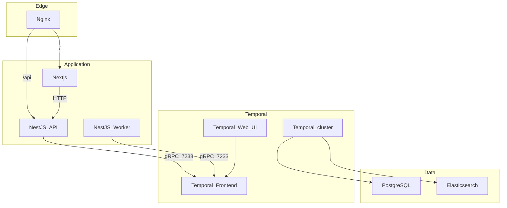

# Plan: Align repo with architecture.md

## Confirmed engineering and product decisions

These choices are **locked** for the first implementation pass:

1. **Temporal + ES**: Use a **minimal** Temporal deployment that **still uses Elasticsearch** for visibility (for example Temporal’s **auto-setup** image or the smallest supported compose recipe that enables ES visibility), rather than a full hand-rolled multi-service production cluster on day one. You can evolve toward the full split in [architecture.md](architecture.md) when needed.
2. **Monorepo tooling**: **npm workspaces** at the repo root (`workspaces: ["app/*", "packages/*"]`).
3. **Temporal code location**: **All** workflow and activity **definitions** live in **`packages/temporal`**; `app/api` and `app/worker` depend on that package and must not duplicate workflow logic.
4. **Browser ↔ API**: **Same-origin** — the UI calls **`/api/...`** (relative URLs); NGINX proxies to Nest. Next **server** components may use an internal base URL (`http://api:<port>`) for SSR container-to-container.
5. **Postgres**: **One PostgreSQL server**, **two databases** (e.g. `temporal` + `app` or names you choose)—init via compose command, init SQL, or image entrypoint pattern; two connection strings in env.
6. **First vertical slice (product)**: **Landing page** with **business information** and a **button (or form) to create a booking request**; the request is handled by **Temporal** (workflow + activities in `packages/temporal`, started from the API, executed by the worker).

## Current state vs target

| Area | Today | Target ([architecture.md](architecture.md)) |
|------|--------|-----------------------------------------------|
| Entry | Direct port 3000 to `web-app` | NGINX on 80/443; `/` → Next.js, `/api` → NestJS |
| UI | [app/web/src/index.js](app/web/src/index.js) Express “Hello World” | Next.js app |
| Backend | None | NestJS API (Temporal **client**, start workflows/signals) |
| Async | None | NestJS **worker** container (`@temporalio/worker`, activities/workflows) |
| Orchestration | None | **Minimal** Temporal + ES + Web UI initially; architecture’s full multi-service cluster as a later hardening step |
| Data | Postgres stub commented in [compose.yml](compose.yml) | PostgreSQL for Temporal + app state; Elasticsearch for visibility/search |

## 1. Repository layout (monorepo)

Introduce a **npm workspaces** monorepo at the repo root so Next, API, and worker share **`packages/temporal`**:

- Root `package.json` with `"workspaces": ["app/*", "packages/*"]` and a single root lockfile (`package-lock.json`).
- **Packages**:
  - `app/web` — Next.js (replace current Express app; remove Express-only [app/web/package.json](app/web/package.json) scripts/deps or repoint folder to a fresh `create-next-app` output).
  - `app/api` — NestJS HTTP API (Temporal **client** only); imports workflow **names/types** and client helpers from `packages/temporal` as needed.
  - `app/worker` — NestJS (or slim Node) bootstrap that registers Temporal **Worker**; imports **workflow + activity implementations** from `packages/temporal` only.
  - **`packages/temporal` (required)** — workflow and activity **definitions**, shared constants (task queue name, workflow IDs), and anything both processes must agree on. Worker bundles workflows from here; API uses generated client types or explicit workflow types exported from this package.

Keep [compose.yml](compose.yml) as the single Compose file (Compose V2 convention); wire every service to a **named bridge network** (e.g. `bsp`) and use **service DNS names** for URLs (`http://api:3001`, `temporal-frontend:7233`, etc.).

## 2. Docker Compose: data and Temporal first

**PostgreSQL**

- Uncomment/extend the existing Postgres service pattern in [compose.yml](compose.yml).
- **One Postgres container, two databases**: e.g. database A for **Temporal** persistence, database B for **application** data (booking requests, etc.). Provision both on first start (official `postgres` image supports `POSTGRES_MULTIPLE_DATABASES` only via custom image/scripts—use an **init script** mounted to `/docker-entrypoint-initdb.d` or a one-shot init container). Document both URLs in `.env.config` (`DATABASE_URL` for app, Temporal’s vars for its store).

**Elasticsearch**

- Add `elasticsearch` (single-node dev profile is enough initially; match architecture’s “visibility” role for Temporal).
- Tune `ES_JAVA_OPTS` and healthchecks so Temporal starts after ES is ready.

**Temporal Server**

- **Minimal stack that still uses ES**: Prefer Temporal’s **auto-setup** (or equivalent single-entry compose) **with Elasticsearch enabled** for advanced visibility—fewer moving parts than the full Frontend/History/Matching split in [architecture.md](architecture.md). Validate workflow visibility in Temporal Web UI. **Later**, migrate compose toward the full multi-service topology for production parity when you outgrow auto-setup.

**Temporal Web UI**

- Add the Web UI container (architecture’s ops console) on an internal port; expose only via NGINX if you want a single public entry (e.g. `/temporal-ui` path-based proxy) or keep it **localhost-only** in dev.

**Dependency order**

- Use `depends_on` with **healthchecks** so API/worker start after `temporal-frontend` (and ES/PG) are healthy.

## 3. NGINX reverse proxy

- Add `nginx` service (uncomment/extend the stub in [compose.yml](compose.yml)) with a mounted config, e.g. `infra/nginx/default.conf`:
  - `location /` → upstream `next:3000` (or whatever port Next listens on inside the network).
  - `location /api/` → `proxy_pass` to NestJS upstream (strip or preserve prefix consistently with Nest global prefix).
  - Optional: `location` for Temporal Web UI.
- For **local dev without TLS**, bind **80 → 80**; document how you would add 443 + certificates later (not required for first vertical slice).
- **Dev parity**: treat NGINX as the **sole** user-facing entry in dev as well—do **not** document or rely on opening `http://localhost:3000` on the host; keep the Next service on the internal network only (omit `ports:` on `web`, or restrict to debugging with a clear warning). Developers use **`http://localhost/`** (or the chosen host port mapped to NGINX) for UI, API, and HMR.

## 4. Next.js frontend (`app/web`)

- Scaffold Next.js (App Router is the current default) into `app/web`, replacing the Express entrypoint.
- **Same-origin API**: In the browser, use **relative** paths only — e.g. `fetch('/api/booking-requests', { method: 'POST', ... })` — so cookies, CSP, and CORS stay trivial. **SSR** `fetch` from Next to Nest may use **`http://api:<port>`** (internal DNS) with an env var such as `INTERNAL_API_URL`; do not expose that URL to the client.
- **First UI**: A **landing** route with **business information** (copy, layout, optional assets under `public/`) and a clear **primary action** to **create a booking request** (button opening a minimal form or POST). Success/error feedback should reflect workflow start (run ID / request id) as appropriate.
- Optional env: leave `NEXT_PUBLIC_API_BASE` **empty** or omit it if all client calls are relative `/api`.

### 4a. Hot reload for frontend assets (easy day-to-day dev)

Goal: edit React/TS, **global CSS**, modules, and files under **`public/`** (images, fonts, favicons) on the host and see updates in the browser **without rebuilding images**.

- **Run the dev server, not production build**: use `next dev` (optionally Turbopack via `next dev --turbopack` when supported by your Next version) as the `web` service command in a **development** Compose override or profile—not `next start`.
- **Bind-mount the app source**: mount `./app/web` (or the whole monorepo root if you need shared packages) into the container so file changes on disk are visible inside the container immediately. Keep `node_modules` either in a named volume or install once on the host; document the chosen approach to avoid slow cross-OS sync issues on macOS if they appear.
- **Fast Refresh**: Next handles component and most CSS edits automatically; static files served from `app/web/public` reload when referenced URLs change or on navigation refresh—no extra tooling required beyond `next dev`.
- **NGINX in front of Next dev (required, not optional)**: Webpack/Turbopack **HMR uses WebSocket**. Proxy `/` to the Next container with the usual headers so HMR works when the browser talks to NGINX on port 80:
  - `proxy_http_version 1.1`
  - `proxy_set_header Upgrade $http_upgrade`
  - `proxy_set_header Connection "upgrade"` (or map-based pattern)
  - sensible `proxy_set_header Host` and `X-Forwarded-*` / `X-Forwarded-Proto` so Next generates correct asset URLs (set `Host`/`X-Forwarded-Host` consistently so dev matches how you will terminate TLS in prod, if applicable).
- **No direct-to-Next bypass**: do not use a Compose profile or README “shortcut” that serves the UI only on `localhost:3000`. That keeps dev aligned with path prefixes, cookies, CSP, and proxy behavior you will ship.
- **Production remains separate**: production Compose (or multi-stage Dockerfile) still uses `next build` + `next start` without bind mounts; hot reload is explicitly a **dev** story documented in [README.md](README.md), still **via NGINX**.

## 5. NestJS API (`app/api`)

- `nest new` (or manual) under `app/api` with global prefix **`api`** so that NGINX `location /api/` maps cleanly to routes like `/api/health`, `/api/booking-requests`.
- Add `@temporalio/client`, configure `Connection` to the Temporal frontend gRPC address exposed by your minimal stack (often `temporal:7233` or `temporal-frontend:7233` depending on image—match compose service name).
- **Booking request**: Implement **`POST /api/booking-requests`** (or similar) that validates input and **starts the booking workflow** defined in `packages/temporal` (import workflow name/options from the shared package). Return a stable **workflow id** or business **request id** to the UI.
- Expose **`GET /api/health`** (or `/api/healthz`) for compose/nginx checks.
- **No** long-running Temporal worker in this container (keeps API horizontally scalable per architecture).

## 6. NestJS Temporal worker (`app/worker`)

- Separate Node process (separate Compose service) that creates `Worker.create` registering **workflows and activities exported from `packages/temporal`** (same `namespace` and **`taskQueue`** constant as the API uses when starting workflows).
- Bundle workflows per Temporal TypeScript SDK guidance (webpack/esbuild config can live in `app/worker` or be shared); source of truth for workflow **code** remains `packages/temporal`.
- In dev, run `tsx`/watch or build step; in Docker, multi-stage Dockerfile `node:20-alpine` (or LTS aligned with Next/Nest) with `npm run build` + `node dist/main.js`.

## 7. Dockerfiles and dev ergonomics

- Add **per-service Dockerfiles** (or one multi-target Dockerfile) for `web`, `api`, `worker` so Compose does not rely on `npm install` on a volume at startup (current [compose.yml](compose.yml) pattern is slow and non-reproducible).
- Update [.dockerignore](.dockerignore) at repo root to exclude `**/node_modules`, `.git`, env files, and build caches so images stay small.
- **Dev vs prod**: use **`compose.override.yml`** (gitignored) or **`compose.dev.yml`** merged with `-f compose.yml -f compose.dev.yml` for: bind mounts, `next dev`, Nest `nest start --watch`, worker `tsx watch`, and the NGINX WebSocket settings in §4a. Keep the base `compose.yml` closer to production-like images for CI or demos.
- **Optional**: `docker compose watch` for selective sync if bind mounts are problematic; still pair with `next dev` for true HMR.

## 8. Configuration and secrets

- `.env.config` at repo with: **two Postgres database URLs** (Temporal DB + app DB) or host/user plus two DB names; Temporal address/namespace/**task queue** (match `packages/temporal`); ES URL for Temporal; **`INTERNAL_API_URL`** for Next SSR; optional `NEXT_PUBLIC_*` only if needed (same-origin can omit public API base).
- Ensure `.gitignore` covers `.env*` (expand [`.gitignore`](.gitignore) if you add more env variants).
- No secrets in compose files; use `env_file` or Docker secrets pattern you prefer.

## 9. Vertical slice before broader features

Order of integration:

1. Compose brings up **Postgres (two DBs) + ES + minimal Temporal + Web UI**; verify Temporal is healthy and ES-backed visibility works from Web UI.
2. Define **`BookingRequest` workflow + activities** in `packages/temporal`; **worker** registers and polls; **API** starts that workflow manually or via a test call; confirm runs in Web UI.
3. **Next** landing page (business copy) + **create booking request** calling **`POST /api/booking-requests`** through **NGINX** only; confirm SSR (if used) and client `fetch('/api/...')` both work.
4. Hardening: persistence for booking rows in **app** DB if needed, idempotency keys, auth, and later migration toward **full** Temporal service split from [architecture.md](architecture.md) if required.

## 10. Documentation

- Update [README.md](README.md) with: **npm workspaces** install/build at root, prerequisites (Docker), `docker compose up` flow, URLs (app via NGINX, `/api/health`, Temporal Web UI if proxied), **two databases on one Postgres**, and that **minimal Temporal + ES** is intentional vs the full diagram in [architecture.md](architecture.md).
- Document **frontend hot reload**: which compose file(s) to use, that edits under `app/web` (including `public/`) reflect live, that **all** requests (including HMR) go through **NGINX on the published host port**, and any macOS bind-mount volume caveats.
- Point new contributors to **Confirmed engineering and product decisions** at the top of this plan (or a short DECISIONS.md only if you want it in-repo later).

## Key files you will add or heavily change

- [compose.yml](compose.yml) — full service graph, networks, volumes, healthchecks.
- `compose.dev.yml` (or `compose.override.yml`) — bind mounts, `next dev`, watch-mode API/worker; NGINX remains the only published app entry (no UI-only bypass profile).
- `infra/nginx/*.conf` — routing as in architecture; **WebSocket upgrade** for Next HMR when proxying the dev server.
- `app/web/*` — Next.js app (replaces Express).
- `app/api/*` — new NestJS API.
- `app/worker/*` — new NestJS Temporal worker.
- **`packages/temporal/*`** — workflows, activities, task queue constants, shared types.
- Root `package.json` — **npm** workspaces; optional `turbo.json` later if builds grow.
- Dockerfiles under `app/web`, `app/api`, `app/worker` (or `docker/`).

## Risks and decisions (no blocker; sensible defaults above)

- **Temporal topology**: **Confirmed** — start with **minimal Temporal + ES** (e.g. auto-setup + Elasticsearch). Plan a deliberate upgrade path to the **full multi-service** layout in [architecture.md](architecture.md) when scale or ops requirements demand it.
- **Elasticsearch**: required for your chosen visibility path; dev machines need enough RAM; document minimums.
- **Compose `name`**: [compose.yml](compose.yml) uses `name: Service Provider Web` — spaces can be awkward for project naming; consider a slug like `busservprov-web` when you edit the file.
- **Dev entry**: NGINX only on the host (e.g. `:80` → nginx); Next stays internal so dev reproduces the same edge behavior as production aside from TLS.
