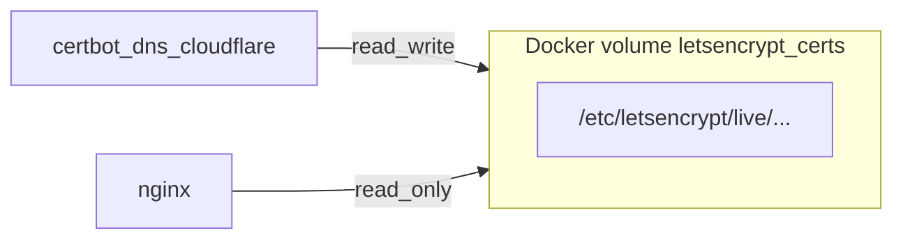

# Let's Encrypt (Cloudflare DNS-01) for production

## Goals

- **DNS-01** via Cloudflare (no `.well-known` on port 80; current HTTP→HTTPS redirect can stay).
- **Named volume** for `/etc/letsencrypt` shared by **certbot** (read/write) and **nginx** (read-only).
- **Domain**: `panda-massage.com` and **`www.panda-massage.com`** on the certificate and in `server_name` (single cert with two `-d` flags).
- **`X-Forwarded-Proto`**: set to literal **`https`** in production nginx for `/`, `/api/`, and `/temporal/` (as requested; note this is redundant when TLS terminates at nginx on 443 but matches your intent for upstreams).

## Compose merge constraint (resolved)

Docker Compose **concatenates** `volumes` across merged files. Two mounts targeting `/etc/nginx/conf.d/default.conf` (e.g. base bind-mount + prod bind-mount) cause a **duplicate mount error**.

You confirmed **no live nginx config edits in dev**, so we **do not** need a host bind mount for `default.conf` in [compose.yml](compose.yml) or [compose.dev.yml](compose.dev.yml).

**Approach** (no merge collision):

1. **[infra/nginx/Dockerfile](infra/nginx/Dockerfile)** — `COPY default.conf` into the image at `/etc/nginx/conf.d/default.conf` so local and `compose.yml`-only runs use the baked-in **self-signed** config (`/etc/nginx/ssl/server.*`).
2. **[compose.yml](compose.yml)** — **remove** the nginx bind mount for `default.conf` (keep `80`/`443`, build, `depends_on`). No replacement mount in [compose.dev.yml](compose.dev.yml).
3. **New [compose.prod.yml](compose.prod.yml)** — nginx is the **only** file that mounts `default.prod.conf` at `/etc/nginx/conf.d/default.conf`, plus `letsencrypt_certs:/etc/letsencrypt:ro`. Base defines **no** config path on that target, so merging `compose.yml` + `compose.prod.yml` stays valid.

## New / changed files

| Artifact | Purpose |
|----------|---------|
| [compose.prod.yml](compose.prod.yml) | Named volume `letsencrypt_certs`; **`certbot` service** only for `docker compose run` + volume/credential wiring (no renewal daemon); nginx extra mounts; `production` profile so local `up` stays unchanged |
| [infra/nginx/default.prod.conf](infra/nginx/default.prod.conf) | `server_name panda-massage.com www.panda-massage.com;`; `ssl_certificate` / `ssl_certificate_key` → `/etc/letsencrypt/live/panda-massage.com/fullchain.pem` and `privkey.pem`; `proxy_set_header X-Forwarded-Proto https;` on proxied locations |
| [infra/secrets/cloudflare.ini.example](infra/secrets/cloudflare.ini.example) | Template: `dns_cloudflare_api_token = ...` (document Zone DNS Edit token) |
| [.gitignore](.gitignore) | Ignore `infra/secrets/cloudflare.ini` (real credentials) |
| [README.md](README.md) | Production flow: create Cloudflare API token, copy `cloudflare.ini`, **initial** `docker compose ... run --rm certbot certonly`, `up`, **cron** invoking the renew script |
| [infra/scripts/renew-letsencrypt.sh](infra/scripts/renew-letsencrypt.sh) | Droplet **cron** entrypoint: `docker compose ... run --rm certbot renew` (same files/volumes as issuance), then `docker compose ... exec nginx nginx -s reload` on success; `set -euo pipefail`; resolve repo root from script path so cron does not depend on `cd` |

## Certbot service

- Image: **`certbot/dns-cloudflare`** (includes the plugin).
- Mounts: named volume `letsencrypt_certs:/etc/letsencrypt`, and **read-only** credentials file e.g. `./infra/secrets/cloudflare.ini:/etc/letsencrypt/cloudflare.ini:ro` (path inside container must match `--dns-cloudflare-credentials`).
- **Not** on the default profile used for local dev; use a **`production`** profile (or only reference `certbot` from `compose.prod.yml` with `profiles: [production]`) so `docker compose -f compose.yml --profile web up` stays unchanged.
- **Initial issuance** (documented, one-shot):  
  `docker compose -f compose.yml -f compose.prod.yml --profile production run --rm certbot certonly --dns-cloudflare --dns-cloudflare-credentials /etc/letsencrypt/cloudflare.ini -d panda-massage.com -d www.panda-massage.com --email ... --agree-tos --non-interactive`
- **Renewal**: **host cron only** (no long-running certbot renewal sidecar). Cron invokes [infra/scripts/renew-letsencrypt.sh](infra/scripts/renew-letsencrypt.sh), which runs `certbot renew` in the same one-shot `compose run` pattern and reloads nginx when renew exits successfully.

## Nginx reload after renew (Plan A — chosen)

Certbot runs in an ephemeral container, so nginx must reload on the host via **`docker compose ... exec nginx nginx -s reload`** after a successful renew.

- **Implementation**: [infra/scripts/renew-letsencrypt.sh](infra/scripts/renew-letsencrypt.sh) performs renew then reload in one script (atomic from an ops perspective: fail renew → no reload; succeed renew or “nothing to do” with exit 0 → reload nginx so any renewed certs are picked up; document that reload after a no-op renew is harmless).
- **README**: Example crontab (e.g. twice daily or daily): `15 3,15 * * * /absolute/path/to/BusServProv-Web/infra/scripts/renew-letsencrypt.sh >>/var/log/bsp-certbot-renew.log 2>&1` — adjust path to the clone on the droplet; ensure the user running cron is in the `docker` group (or use root, per your security policy).
- **Out of scope**: Docker-socket sidecar (former plan B).

## Cloudflare credentials file (`infra/secrets/cloudflare.ini`)

This file is **not application config** for your Node services; it exists **only** for **Certbot’s** [`certbot-dns-cloudflare`](https://certbot-dns-cloudflare.readthedocs.io/) plugin when using **DNS-01** validation.

**What it contains**

- A small **INI** file read by Certbot inside the container. The plugin expects a line of the form:

  `dns_cloudflare_api_token = <token>`

  (Exact key name must match the plugin; the committed [infra/secrets/cloudflare.ini.example](infra/secrets/cloudflare.ini.example) shows the template.)

**What the token is for**

- Let’s Encrypt asks Certbot to prove control of the domain by creating **temporary TXT records** under `_acme-challenge.panda-massage.com` (and the `www` name if included). The API token lets Cloudflare’s API create/delete those TXT records **only** for your zone. No HTTP listener or port 80 challenge is required.

**Where you get the token**

- In Cloudflare: **My Profile → API Tokens → Create Token**. Use a custom token with **Zone → DNS → Edit** scoped to zone **`panda-massage.com`** (and read zone if the template asks). Do **not** commit the real token.

**Security and repo hygiene**

- Real file path: **`infra/secrets/cloudflare.ini`** — add to [.gitignore](.gitignore) so it never ships in git.
- On the droplet: restrictive permissions (**`chmod 600`**) and a dedicated non-root deploy user where practical.
- Compose mounts this file **read-only** into the Certbot container (e.g. at `/etc/letsencrypt/cloudflare.ini`); the **`--dns-cloudflare-credentials`** flag must point at that in-container path.

**Why `.ini` and not env vars alone**

- The upstream plugin is documented around an **credentials file**; keeping that shape avoids ad-hoc wrappers and matches Certbot’s examples.

## Bootstrap order (production, first machine or empty volume)

There is a deliberate **chicken-and-egg**: [infra/nginx/default.prod.conf](infra/nginx/default.prod.conf) will reference **`/etc/letsencrypt/live/panda-massage.com/fullchain.pem`** (and `privkey.pem`). If those files are missing, **nginx will fail to start** when Compose brings `nginx` up with the prod overlay. So **certificate issuance must run before** (or without starting) nginx on the first deploy, or you must accept a one-time ordering in the README.

**Recommended first-time sequence** (to be spelled out in [README.md](README.md)):

1. **DNS** — In Cloudflare, `panda-massage.com` (and `www` if used) points at the droplet **or** you use proxied/orange-cloud; DNS-01 only requires that Cloudflare is authoritative for the zone (which it is if Cloudflare hosts DNS). The droplet does not need to receive ACME HTTP traffic for DNS-01.

2. **Clone / layout** — Repo on the droplet at a stable path (used by cron and compose).

3. **Secrets** — Copy [infra/secrets/cloudflare.ini.example](infra/secrets/cloudflare.ini.example) → `infra/secrets/cloudflare.ini`, insert the API token, **`chmod 600`**.

4. **Create the Docker volume (implicit)** — The first `compose run` or `up` that references the named volume `letsencrypt_certs` creates it; no manual `docker volume create` is strictly required unless you want an empty volume inspected first.

5. **Initial certificate (before nginx with LE paths)** — From the repo root, run the **one-shot** `certonly` command (see [Certbot service](#certbot-service)) with **`--profile production`** so the `certbot` service definition, Cloudflare INI mount, and `letsencrypt_certs` volume are all attached. This writes `live/panda-massage.com/` (and renewal metadata) into the volume. **Do not** start nginx with `default.prod.conf` until this step succeeds.

6. **Start the stack** — `docker compose -f compose.yml -f compose.prod.yml --profile web --profile production up -d` (or equivalent: include every profile needed for `web` + `nginx` + Temporal if using full profile). Nginx now finds the LE files on the mounted volume.

7. **Cron** — Install the example crontab line calling [infra/scripts/renew-letsencrypt.sh](infra/scripts/renew-letsencrypt.sh) so renewals and nginx reload happen automatically.

**Subsequent deploys / new droplet**

- If the **`letsencrypt_certs` volume** is preserved or restored from backup, step 5 can be skipped until the cert nears expiry (renew handles the rest). If the volume is **wiped**, repeat steps 5→6 before expecting HTTPS to work.

**Common failure to call out in README**

- `certonly` succeeds but nginx still fails: wrong compose files (prod overlay not applied), wrong `server_name` vs cert SAN, or volume not mounted on `nginx` the same way as on `certbot`.

## Optional follow-up (not required for LE)

- [compose.yml](compose.yml) `TEMPORAL_CORS_ORIGINS` is `http://localhost`; for production you may later set `https://panda-massage.com` via env override in `compose.prod.yml` — call out in README as optional.

## Verification

- After deploy: `curl -I https://panda-massage.com` returns valid chain (no self-signed).
- Renew dry-run: `docker compose ... run --rm certbot renew --dry-run`.
