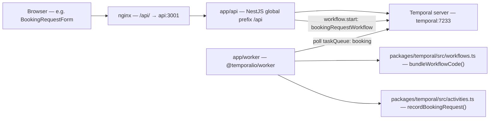

# API, worker, and Temporal structure and editing guide

This document describes how the **NestJS API** (`app/api`), the **Temporal worker** (`app/worker`), and the shared **Temporal definitions** (`packages/temporal`) fit together with **Docker Compose** infrastructure. It mirrors the style of `front end structure.md`.

Paths below are from the **repository root**.

## End-to-end flow (booking request)

A `POST` from the browser (via nginx) reaches the API, which starts a **workflow** on the Temporal server. A **worker** process polls the same **task queue**, runs the workflow code (deterministic), and executes **activities** (side effects) in the worker.

### Practical meaning

- **Edit HTTP routes and request validation**: `app/api/src` (controllers, DTOs). Nest mounts everything under the **`api`** global prefix (`app/api/src/main.ts`), so controller paths are `/api/...` from the app’s origin (or nginx when proxied).
- **Start workflows from HTTP**: inject `TemporalClientService` and call `client.workflow.start` with the workflow **type** and **task queue** aligned with `packages/temporal/src/constants.ts`.
- **Edit orchestration (steps, timers, signals)**: `packages/temporal/src/workflows.ts` — keep workflows deterministic; no I/O here.
- **Edit side effects (DB, email, HTTP)**: `packages/temporal/src/activities.ts` — activities run in the **worker** process.
- **Change queue name, namespace, or workflow type string**: `packages/temporal/src/constants.ts` (API and worker both import `@bsp/temporal`).
- **Infra wiring** (ports, env, which containers run): `compose.yml`, `infra/nginx/default.conf`.

## Compose services (how pieces connect)

| Service | Role |
|---------|------|
| **postgres** | Database for Temporal (and init script creates an `app` DB for future app use). |
| **elasticsearch** | Temporal visibility / advanced persistence in this stack. |
| **temporal** | Temporal server (`temporalio/auto-setup`). |
| **temporal-ui** | Web UI for workflows; nginx exposes it under `/temporal/` (requires `TEMPORAL_UI_PUBLIC_PATH=/temporal`). |
| **api** | NestJS; env `TEMPORAL_ADDRESS`, `TEMPORAL_NAMESPACE`, `TEMPORAL_TASK_QUEUE`. |
| **worker** | Runs `app/worker`; bundles workflows from `WORKFLOWS_PATH` (defaults to monorepo `packages/temporal/src/workflows.ts`). Same Temporal env vars as API for queue/namespace. |
| **web** | Next.js frontend. |
| **nginx** | Routes `/api/` → API, `/temporal/` → Temporal UI, `/` → Next. |

## Concerns → primary file(s)

| Concern | Primary file(s) | Supporting pieces |
|---------|-----------------|---------------------|
| **HTTP API bootstrap** | `app/api/src/main.ts` | Global prefix `api`, `ValidationPipe`, `PORT` |
| **Register controllers / providers** | `app/api/src/app.module.ts` | Wires `HealthController`, `BookingRequestsController`, `TemporalClientService` |
| **Liveness / readiness style check** | `app/api/src/health.controller.ts` | `GET /api/health` |
| **Create booking → start workflow** | `app/api/src/booking-requests.controller.ts` | `TemporalClientService`, `CreateBookingRequestDto`, workflowId `booking-request-<uuid>` |
| **Request body shape + validation** | `app/api/src/dto/create-booking-request.dto.ts` | `class-validator` decorators |
| **Temporal client lifecycle** | `app/api/src/temporal-client.service.ts` | Connect retry, namespace, `getClient()` / `getTaskQueue()` / `getWorkflowType()` |
| **Worker entry + registration** | `app/worker/src/main.ts` | resolves `WORKFLOWS_PATH`, `bundleWorkflowCode`, `Worker.create`, registers `recordBookingRequest` |
| **Workflow definition** | `packages/temporal/src/workflows.ts` | `proxyActivities`, exported workflow function `bookingRequestWorkflow(details)` |
| **Activity implementations** | `packages/temporal/src/activities.ts` | Runs in worker, not in API |
| **Shared constants / package exports** | `packages/temporal/src/constants.ts`, `packages/temporal/src/index.ts` | Package name `@bsp/temporal` |
| **Reverse proxy paths** | `infra/nginx/default.conf` | `/api/`, `/temporal/`, `/` upstreams |
| **Local stack topology** | `compose.yml` | Service `depends_on`, networks, env defaults |

### Entry points

- **API process**: `app/api/src/main.ts` → `AppModule`.
- **Worker process**: `app/worker/src/main.ts` (ESM; resolves workflow file via `WORKFLOWS_PATH` or monorepo-relative default; bundles at startup).

### Monorepo workspace

- Root `package.json` workspaces: `app/*`, `packages/*`.
- **`@bsp/api`** depends on `@temporalio/client` and `@bsp/temporal`.
- **`@bsp/worker`** depends on `@temporalio/worker` and `@bsp/temporal` (workflows bundled at worker startup; activities imported from `@bsp/temporal/activities`).

## Quick mental model

1. **`packages/temporal`** is the **contract**: constants (queue, workflow type name), workflow source, and activity implementations used by the worker.
2. **`app/api`** is the **edge**: validates HTTP input and **starts** workflows; it does not execute workflow or activity code.
3. **`app/worker`** is the **executor**: long-lived process that must be running for workflows on the booking task queue to make progress.
4. **Temporal server** stores workflow state; **API and worker** are separate clients of that server.

## Adding more behavior later

- **New HTTP endpoint**: add a controller (or route on an existing controller) in `app/api/src`, register it in `app.module.ts`, add DTOs under `app/api/src/dto/` as needed.
- **New workflow or step**: extend `packages/temporal/src/workflows.ts`; add or extend activities in `activities.ts`; export types/constants if other packages need them; ensure the worker’s `activities: { ... }` map in `app/worker/src/main.ts` includes new handlers.
- **New workflow type string**: add a constant in `packages/temporal/src/constants.ts` and use it from both API (`TemporalClientService` or controller) and any callers; keep the **exported function name** in `workflows.ts` aligned with what the client passes as the workflow type (see existing `BOOKING_REQUEST_WORKFLOW_TYPE`).
